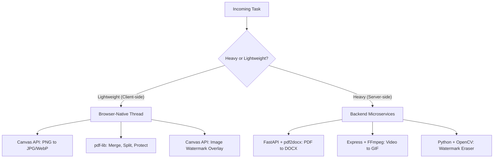

# Comprehensive Guide: Building an SEO-Optimized Multi-Tool Web Platform

Welcome to the definitive architectural and technical roadmap for building a high-performance, programmatically optimized multi-tool web application. This guide details how to build and orchestrate client-side and server-side file utility systems (PDF, Image, and Video conversions) optimized for search visibility (SEO) and scale.

---

## Table of Contents
1. [Phase 1: Architecture & Core Stack Definition](#phase-1-architecture--core-stack-definition)
   - [1.1 Processing Strategy Boundaries](#11-processing-strategy-boundaries)
   - [1.2 Programmatic Routing Structure & Silo Directory Framework](#12-programmatic-routing-structure--silo-directory-framework)
2. [Phase 2: Frontend Setup & Technical SEO Engine](#phase-2-frontend-setup--technical-seo-engine)
   - [2.1 Next.js Dynamic Shell Pre-rendering (SSG & Core Web Vitals)](#21-nextjs-dynamic-shell-pre-rendering-ssg--core-web-vitals)
   - [2.2 Programmatic JSON-LD Schema Metadata Integration](#22-programmatic-json-ld-schema-metadata-integration)
3. [Phase 3: Client-Side Processing Implementation](#phase-3-client-side-processing-implementation)
   - [3.1 Image Processing Engine via Canvas API](#31-image-processing-engine-via-canvas-api)
   - [3.2 Local Client-Side PDF Utilities Workspace](#32-local-client-side-pdf-utilities-workspace)
4. [Phase 4: High-Performance Backend Processing Infrastructure](#phase-4-high-performance-backend-processing-infrastructure)
   - [4.1 Media Processing Core using FFmpeg](#41-media-processing-core-using-ffmpeg)
   - [4.2 Advanced Python Document Conversion Pipeline (FastAPI & pdf2docx)](#42-advanced-python-document-conversion-pipeline-fastapi--pdf2docx)
5. [Phase 5: Enterprise Scaling & Operational Security Safeguards](#phase-5-enterprise-scaling--operational-security-safeguards)
   - [5.1 Automated Storage Lifecycle Managers](#51-automated-storage-lifecycle-managers)
   - [5.2 Edge Optimization & Global Sitemaps](#52-edge-optimization--global-sitemaps)

---

## Phase 1: Architecture & Core Stack Definition

### 1.1 Processing Strategy Boundaries

To eliminate server bottlenecks and minimize operating costs, we decouple lightweight, fast browser-native tasks from heavy, complex backend operations. This ensures maximum efficiency and optimal Core Web Vitals (specifically FID/INP and LCP).



#### Decision Matrix: Client vs. Server
*   **Client-Side Operations**: Triggered inside web workers or main threads. Zero server egress/ingress fees, privacy-preserving (files never leave the device), and instantaneous processing.
*   **Server-Side Operations**: Managed via API endpoints. Handled by optimized binaries (FFmpeg, LibreOffice, Python packages) inside sandboxed environments.

---

### 1.2 Programmatic Routing Structure & Silo Directory Framework

To capture long-tail search queries (e.g., "protect pdf with password online"), each utility requires an independent, pre-rendered route. This structure is called a **Silo Directory Topology**.

```
frontend/src/app/
├── sitemap.ts
├── layout.tsx
├── page.tsx
├── pdf/
│   ├── page.tsx
│   ├── convert-pdf-to-word/
│   │   └── page.tsx
│   └── protect-pdf-with-password/
│       └── page.tsx
├── image/
│   ├── page.tsx
│   └── convert-png-to-jpg/
│       └── page.tsx
└── video/
    └── convert-video-to-gif/
        └── page.tsx
```

By flattening directories into intuitive sub-paths, search crawlers understand the hierarchy:
*   `/pdf` is the hub page targeting the seed keyword "PDF utilities".
*   `/pdf/convert-pdf-to-word` targets long-tail search queries.

---

## Phase 2: Frontend Setup & Technical SEO Engine

### 2.1 Next.js Dynamic Shell Pre-rendering (SSG & Core Web Vitals)

To prevent search engines from receiving blank pages, the core text, navigation, and explanation sections are pre-rendered at build time using Static Site Generation (SSG). The interactive upload dropzone and processing client components are loaded asynchronously via dynamic hydration.

#### Core Web Vitals Safeguards:
1.  **Preventing Cumulative Layout Shift (CLS)**: We define explicit dimensions for upload boxes, wrappers, and text layouts.
2.  **Minimizing Bundles**: Dynamic elements are imported using Next.js `dynamic()` with `ssr: false`.

#### Example CSS (Tailwind Rules) for Box-Sizing & Layout:
```css
/* Ensure content shifts are prevented by keeping structural shells stable */
.tool-container {
  display: flex;
  flex-direction: column;
  min-height: 400px;
  contain: content; /* CSS containment to prevent rendering reflows */
}
```

---

### 2.2 Programmatic JSON-LD Schema Metadata Integration

We dynamically inject JSON-LD markup on tool pages. This allows search engines to feature our tools in rich snippets, "People Also Ask" grids, and app carousels.

#### Schema Implementations:
1.  **WebApplication**: Declares operational boundaries and software requirements.
2.  **HowTo**: Provides search engines with structured, step-by-step instructions.
3.  **FAQPage**: Powers rich dropdowns in Google Search Results.

#### Reusable React component (`SeoMeta.tsx`):
```tsx
import Head from 'next/head';

interface SchemaProps {
  toolName: string;
  description: string;
  url: string;
  steps: string[];
  faqs: { question: string; answer: string }[];
}

export default function SeoMeta({ toolName, description, url, steps, faqs }: SchemaProps) {
  const webAppSchema = {
    "@context": "https://schema.org",
    "@type": "WebApplication",
    "name": toolName,
    "url": url,
    "description": description,
    "applicationCategory": "UtilityApplication",
    "operatingSystem": "All"
  };

  const howToSchema = {
    "@context": "https://schema.org",
    "@type": "HowTo",
    "name": `How to use ${toolName}`,
    "description": description,
    "step": steps.map((step, idx) => ({
      "@type": "HowToStep",
      "position": idx + 1,
      "text": step
    }))
  };

  const faqSchema = {
    "@context": "https://schema.org",
    "@type": "FAQPage",
    "mainEntity": faqs.map(faq => ({
      "@type": "Question",
      "name": faq.question,
      "acceptedAnswer": {
        "@type": "Answer",
        "text": faq.answer
      }
    }))
  };

  return (
    <script
      type="application/ld+json"
      dangerouslySetInnerHTML={{
        __html: JSON.stringify([webAppSchema, howToSchema, faqSchema])
      }}
    />
  );
}
```

---

## Phase 3: Client-Side Processing Implementation

### 3.1 Image Processing Engine via Canvas API

Images are processed fully client-side using the Canvas API, keeping user data private and bypassing network overhead.

#### Implementation Flow:
1.  Read the selected image file using a `FileReader` or create an object URL.
2.  Load the binary into an HTML5 `Image` element.
3.  Set canvas dimensions to match the target output scale.
4.  Render the image to the canvas context (`ctx.drawImage`).
5.  Call `canvas.toDataURL("image/jpeg", quality)` or `canvas.toBlob()` to extract the processed file.

```typescript
export async function convertPngToJpg(file: File, quality: number = 0.9): Promise<string> {
  return new Promise((resolve, reject) => {
    const reader = new FileReader();
    reader.onload = (e) => {
      const img = new Image();
      img.onload = () => {
        const canvas = document.createElement('canvas');
        canvas.width = img.width;
        canvas.height = img.height;
        const ctx = canvas.getContext('2d');
        if (!ctx) return reject(new Error("Canvas context is unavailable"));
        
        ctx.fillStyle = '#FFFFFF'; // Ensure transparent PNG pixels turn white
        ctx.fillRect(0, 0, canvas.width, canvas.height);
        ctx.drawImage(img, 0, 0);
        
        const dataUrl = canvas.toDataURL('image/jpeg', quality);
        resolve(dataUrl);
      };
      img.onerror = () => reject(new Error("Failed to load image"));
      img.src = e.target?.result as string;
    };
    reader.onerror = () => reject(new Error("Failed to read file"));
    reader.readAsDataURL(file);
  });
}
```

---

### 3.2 Local Client-Side PDF Utilities Workspace

We execute client-side PDF modifications using `pdf-lib`, which lets us modify, merge, or password-protect files in-browser.

#### Implementation Flow:
1.  Read files into memory as `ArrayBuffer` payloads.
2.  Load the PDF document using `PDFDocument.load(arrayBuffer)`.
3.  Encrypt the document using user-defined password keys.
4.  Write the modified structure back to a Uint8Array (`pdfDoc.save()`).
5.  Trigger a local browser download without passing data to external servers.

```typescript
import { PDFDocument } from 'pdf-lib';

export async function protectPdf(pdfBuffer: ArrayBuffer, userPass: string, ownerPass: string): Promise<Uint8Array> {
  const pdfDoc = await PDFDocument.load(pdfBuffer);
  
  // Encrypt PDF with explicit passwords and permissions
  pdfDoc.encrypt({
    userPassword: userPass,
    ownerPassword: ownerPass,
    permissions: {
      printing: 'highResolution',
      modifying: false,
      copying: false
    }
  });
  
  return await pdfDoc.save();
}
```

---

## Phase 4: High-Performance Backend Processing Infrastructure

### 4.1 Media Processing Core using FFmpeg

For computationally heavy file updates (like converting mp4 to gif), we route requests to our Node.js microservice equipped with FFmpeg.

#### Node.js Express Controller:
```typescript
import express from 'express';
import multer from 'multer';
import { exec } from 'child_process';
import path from 'path';
import fs from 'fs';

const router = express.Router();
const upload = multer({ dest: 'uploads/' });

router.post('/video-to-gif', upload.single('video'), (req, res) => {
  if (!req.file) return res.status(400).json({ error: 'No video file uploaded' });

  const inputPath = req.file.path;
  const outputPath = path.join('uploads', `${req.file.filename}.gif`);

  // Optimized FFmpeg conversion command reducing scale and matching frame rate limits
  const ffmpegCmd = `ffmpeg -i ${inputPath} -vf "fps=15,scale=480:-1:flags=lanczos,split[s0][s1];[s0]palettegen[p];[s1][p]paletteuse" -loop 0 ${outputPath}`;

  exec(ffmpegCmd, (error) => {
    // Cleanup incoming file immediately
    fs.unlink(inputPath, () => {});

    if (error) {
      console.error(error);
      return res.status(500).json({ error: 'FFmpeg processing failed' });
    }

    res.download(outputPath, 'converted.gif', () => {
      // Cleanup output file after download
      fs.unlink(outputPath, () => {});
    });
  });
});
```

---

### 4.2 Advanced Python Document Conversion Pipeline (FastAPI & pdf2docx)

PDF to Word (DOCX) operations are handled by a Python service running `FastAPI` and the `pdf2docx` library. This preserves text formatting, fonts, and layout coordinates.

#### Python FastAPI Application:
```python
from fastapi import FastAPI, UploadFile, File
from fastapi.responses import FileResponse
from fastapi.middleware.cors import CORSMiddleware
from pdf2docx import Converter
import uuid
import os
import shutil

app = FastAPI()

app.add_middleware(
    CORSMiddleware,
    allow_origins=["*"],
    allow_methods=["*"],
    allow_headers=["*"],
)

TEMP_DIR = "temp_conversions"
os.makedirs(TEMP_DIR, exist_ok=True)

@app.post("/convert/pdf-to-docx")
async def convert_pdf_to_docx(file: UploadFile = File(...)):
    task_id = str(uuid.uuid4())
    pdf_path = os.path.join(TEMP_DIR, f"{task_id}.pdf")
    docx_path = os.path.join(TEMP_DIR, f"{task_id}.docx")

    # Ingest incoming stream
    with open(pdf_path, "wb") as buffer:
        shutil.copyfileobj(file.file, buffer)

    try:
        # pdf2docx converter structures paragraphs and tables
        cv = Converter(pdf_path)
        cv.convert(docx_path, start=0, end=None)
        cv.close()
    except Exception as e:
        if os.path.exists(pdf_path): os.remove(pdf_path)
        return {"error": str(e)}, 500

    # Clean up pdf after conversion
    os.remove(pdf_path)

    # Return the file, cleaning up docx after transport completes
    return FileResponse(
        path=docx_path,
        media_type="application/vnd.openxmlformats-officedocument.wordprocessingml.document",
        filename="converted.docx"
    )
```

---

## Phase 5: Enterprise Scaling & Operational Security Safeguards

### 5.1 Automated Storage Lifecycle Managers

To prevent server storage from filling up and leak user files, we schedule automated cleaning routines.

```typescript
import cron from 'node-cron';
import fs from 'fs';
import path from 'path';

const TEMP_DIR = path.join(__dirname, '..', 'uploads');

// Cleanup tasks every 15 minutes
cron.schedule('*/15 * * * *', () => {
  const now = Date.now();
  const MaxAgeMs = 15 * 60 * 1000; // Files older than 15 minutes are purged

  fs.readdir(TEMP_DIR, (err, files) => {
    if (err) return console.error('Failed to read storage directory:', err);

    files.forEach(file => {
      const filePath = path.join(TEMP_DIR, file);
      
      fs.stat(filePath, (err, stats) => {
        if (err) return;

        if (now - stats.mtimeMs > MaxAgeMs) {
          fs.unlink(filePath, (err) => {
            if (!err) console.log(`Lifecycle Manager: Cleaned stale resource: ${file}`);
          });
        }
      });
    });
  });
});
```

---

### 5.2 Edge Optimization & Global Sitemaps

To handle high traffic, we leverage Cloudflare rules to cache the static application shell while excluding processing endpoints. We also configure Next.js to dynamically generate a sitemap.

#### Next.js Sitemap Configuration (`frontend/src/app/sitemap.ts`):
```typescript
import { MetadataRoute } from 'next';

export default async function sitemap(): Promise<MetadataRoute.Sitemap> {
  const baseUrl = 'https://multitoolplatform.example.com';
  
  const routes = [
    '',
    '/pdf',
    '/pdf/convert-pdf-to-word',
    '/pdf/protect-pdf-with-password',
    '/image',
    '/image/convert-png-to-jpg',
    '/video/convert-video-to-gif'
  ];

  return routes.map(route => ({
    url: `${baseUrl}${route}`,
    lastModified: new Date(),
    changeFrequency: 'weekly' as const,
    priority: route === '' ? 1.0 : 0.8
  }));
}
```

#### Cloudflare Page Cache Configuration Rules:
1.  **Cache Level**: *Cache Everything* for `/_next/static/*` and all asset folders.
2.  **Edge TTL**: *7 Days* for assets, *1 Hour* for page routes.
3.  **Bypass Cache**: Avoid caching routes matching `/api/*` to ensure live file transformations execute in real-time.

---

## 🛠️ Complete Multi-Tool Registry & Universal Workflows

### 1. Document & File Processing Tool Registry

Our enterprise multi-tool suite is divided into 7 core functional categories:

#### Category 1: PDF Conversion Utilities
*   **PDF to Word**: Converts PDF files into editable DOC and DOCX documents with high layout and font preservation accuracy.
*   **PDF to PowerPoint**: Turns PDF files into editable PPT and PPTX slideshow presentations.
*   **PDF to Excel**: Pulls structural tables and raw data straight from PDF grids into Excel spreadsheets.
*   **Word to PDF**: Converts Microsoft Word files (DOC/DOCX) into high-fidelity PDF documents.
*   **PowerPoint to PDF**: Converts PowerPoint presentations (PPT/PPTX) into standardized PDF format.
*   **Excel to PDF**: Converts Excel spreadsheets into readable, print-ready PDF formats.
*   **PDF to JPG**: Converts each page of a PDF into a separate JPG image, or extracts all embedded images from within the document.
*   **JPG to PDF / Image to PDF**: Converts JPG, PNG, and other image formats to PDF, letting users adjust page orientation and margins.
*   **HTML to PDF**: Converts active web pages into PDF files by processing the page's public URL.
*   **PDF to PDF/A**: Transforms standard PDFs into the ISO-standardized PDF/A format for long-term archiving.

#### Category 2: Document Organization & Editing
*   **Merge PDF**: Combines multiple PDF files into a single document in any custom order.
*   **Split PDF**: Separates specific pages or ranges from a document to create independent PDF files.
*   **Organize PDF**: Allows users to sort, delete, or insert new pages into an existing PDF file.
*   **Rotate PDF**: Rotates single or multiple PDF pages simultaneously.
*   **Crop PDF**: Trims document margins or isolates specific regions, applying changes to a single page or the entire file.
*   **Edit PDF**: Inserts text, images, shapes, or freehand annotations directly into a PDF with custom styling.
*   **Page numbers**: Adds page numbers to a PDF with custom placement, dimensions, and typography.
*   **Watermark**: Stamps a text or image watermark over a PDF with control over font, position, and transparency.

#### Category 3: Document Optimization & Repair
*   **Compress PDF**: Shrinks the file size of a document while preserving the highest possible visual quality.
*   **Repair PDF**: Analyzes and repairs corrupted or damaged PDF files to recover lost data.

#### Category 4: Security, Redaction & Electronic Signatures
*   **Sign PDF**: Allows users to electronically sign documents or send out secure, legally binding eSignature requests.
*   **Unlock PDF**: Removes password-based security restrictions from a PDF, giving freedom to edit, print, or copy.
*   **Protect PDF**: Encrypts and secures PDF files by adding a custom password to prevent unauthorized access.
*   **Redact PDF**: Permanently blacks out and deletes sensitive text or graphical information.

#### Category 5: Advanced & AI-Powered Document Intelligence
*   **OCR PDF**: Performs Optical Character Recognition to convert scanned PDFs into fully searchable and selectable text.
*   **Compare PDF**: Generates a side-by-side comparison of two document versions to easily identify text and visual changes.
*   **PDF Forms**: Automatically detects form fields, creates interactive fillable PDFs, or allows manual form-filling.
*   **Scan to PDF**: Integrates with mobile devices to capture paper documents via camera and sync directly to the browser.
*   **AI Summarizer**: Uses AI to extract key points and generate summaries from long-form text.
*   **Translate PDF**: Translates entire PDF documents into different languages using AI while keeping layout, formatting, and fonts intact.
*   **Create a Workflow**: Combines several of your favorite tools into custom, automated sequences that can be saved and reused.

#### Category 6: Image Optimization, Conversion & Creative Editing
*   **Compress IMAGE**: Compresses JPG, PNG, SVG, and GIFs to save storage space while maintaining visual quality.
*   **Resize IMAGE / Image Resizer**: Allows users to define custom dimensions (by percentage or specific pixels) for JPG, PNG, SVG, and GIF images.
*   **Crop IMAGE / Crop Image**: Trims JPG, PNG, or GIFs using a visual editor or by specifying exact pixel coordinates.
*   **Convert to JPG / HEIC to JPG**: Enables bulk conversion of diverse image formats (PNG, GIF, TIF, PSD, SVG, WEBP, HEIC, RAW) into standard JPGs.
*   **Convert from JPG**: Turns JPG files into PNG or GIF formats, or compiles multiple JPGs to generate an animated GIF.
*   **HTML to IMAGE**: Converts entire HTML webpages into JPG or SVG files by processing the webpage's URL.
*   **Photo editor**: A simplified suite of tools to add text, custom effects, borders, frames, or stickers directly onto pictures.
*   **Meme generator**: An online tool to design custom memes by adding captioned text to popular templates or custom uploaded photos.
*   **Rotate IMAGE**: Rotates multiple JPG, PNG, or GIF images simultaneously with selective orientation targets.
*   **Upscale Image**: Uses AI to enlarge JPG and PNG files to a higher resolution, boosting dimensions while preserving details.
*   **Remove background**: Instantly detects primary subjects and cleanly cuts out image backgrounds.
*   **Watermark IMAGE**: Stamps a text or image watermark over your pictures with control over typography and transparency.
*   **Blur face**: Allows users to hide private information in photos by blurring out faces, license plates, and sensitive objects.

#### Category 7: Multimedia, Specialized Format & Universal Converters
*   **Video Converters**: MP4 Converter, Video to GIF, MOV to MP4, Video Converter.
*   **Audio Converters**: MP3 Converter, MP4 to MP3, Video to MP3, Audio Converter.
*   **Ebook & Special Documents**: EPUB to PDF, EPUB to MOBI, Document Converter.
*   **Archive Compressors**: RAR to Zip, Archive Converter.
*   **Time-Zone Tools**: PST to EST, CST to EST.
*   **Unit Converters**: Lbs to Kg, Kg to Lbs, Feet to Meters, Unit Converter.
*   **Web & Creative Apps**: Collage Maker, Color Picker.
*   **Mobile Applications**: Collage Maker Android/iOS, Image Converter Android/iOS.

---

### 2. Step-by-Step Universal File Processing Workflow

Follow these structural steps to execute tasks using any of the tools in the toolbox:

1.  **Analyze and Select**: Identify your source file type and desired outcome. Locate the precise tool matching your intent from the categorized list.
2.  **Import the Source Asset**:
    *   *Standard File Uploads*: Upload local files or paste an HTML URL directly into the tool interface.
    *   *Paper Documents*: Use the Scan to PDF camera integration via a mobile device to sync the digital copy to your workstation.
3.  **Configure Options and Adjustments**: Set custom parameters based on the operation:
    *   *Optimization*: Select compression levels or upscale criteria.
    *   *Visual Modification*: Adjust crop boundaries, rotate viewports, or position typography watermarks and page numbers.
4.  **Execute & Download**: Confirm the action. For local tools, the browser compiles the output in-memory and triggers a prompt immediately. For cloud tools, the secure background service processes the stream, yields the file payload, and cleans up temporary resources.

# tools

# tools

